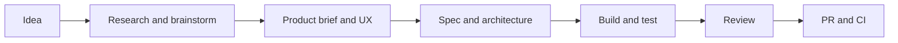

# BMAD Method × Android: a working example

This repository is a small, runnable example of using **BMAD Method** in an Android project. It is written for someone who has never used BMAD: start with the workflow below, open the skills, then run the app. The Android screen is deliberately tiny so the project setup and development process are easy to inspect.

BMAD is an AI-assisted **development method**, not an Android library. Its skills give an AI coding agent structured ways to explore a product idea, plan work, design an experience, implement code, and review the result. The app does not contain BMAD runtime code; BMAD lives in the repository and is used while developing the app.




BMAD can handle a small change directly through `bmad-build`, or use the earlier stages when the problem needs more discovery. You choose the depth; the documents give later stages durable context. See the [official workflow map](https://docs.bmad-method.org/reference/workflow-map/) for the full set of paths.

## What you can do with it

These are representative skills installed in this repository for Codex. Invoke them as `$skill-name` in an agent conversation.

| Goal | Skill | Example request |
| --- | --- | --- |
| Find the next useful step | `bmad-help` | “I have a small Android feature idea. What should I do next?” |
| Generate and challenge ideas | `bmad-brainstorming`, `bmad-forge-idea` | “Explore three ways to make onboarding clearer.” |
| Research a decision | `bmad-deep-recon` | “Compare approaches to offline storage for this app.” |
| Define product intent | `bmad-product-brief`, `bmad-prd` | “Turn this idea into a brief with measurable outcomes.” |
| Design the user experience | `bmad-ux`, `bmad-agent-ux-designer` | “Design the first-run experience.” |
| Plan implementation | `bmad-spec`, `bmad-architecture` | “Specify the button behavior and Android constraints.” |
| Implement and verify | `bmad-build`, `bmad-agent-dev` | “Implement this accepted Android change.” |
| Review code and test gaps | `bmad-code-review`, `bmad-review` | “Review this branch for defects and missing verification.” |
| Explore several perspectives | `bmad-party-mode` | “Discuss this feature as PM, designer, and engineer.” |

BMAD also provides skills for epics, sprint planning, QA test generation, and retrospectives. The exact catalog depends on the installed modules and version; inspect [`.agents/skills`](.agents/skills) or ask `$bmad-help` for this checkout. Code review and test generation help prepare a change for merging. **Automatic PR merging is a separate GitHub repository setting or automation**, with its own permissions and branch rules; this demo does not enable it.

## See the method in this repository

1. Read the short [product brief](docs/product-brief.md) for the audience, problem, and acceptance criteria.
2. Read [project context](docs/project-context.md) for the Android conventions an agent should preserve.
3. Inspect [BMAD configuration](_bmad/config.toml) and the generated skills in [`.agents/skills`](.agents/skills). BMAD Method 6.12.0 installed the Core and Method modules for Codex here.
4. Inspect the original [`android-bmad-development` skill](.agents/skills/android-bmad-development/SKILL.md). It adds Android-specific implementation and verification guidance, with references for MVVM, Hilt, and feature api/impl modules, without changing BMAD's generated skills.
5. Inspect the [Compose screen](app/src/main/java/com/maxlord/bmadandroiddemo/MainActivity.kt), [interaction test](app/src/androidTest/java/com/maxlord/bmadandroiddemo/HelloWorldScreenTest.kt), and [CI workflow](.github/workflows/android.yml).

A practical agent conversation could be:

```text
$bmad-help How should I approach a small Android UI change in this project?
$bmad-spec Specify a screen with a button that changes a label to Hello World.
$android-bmad-development Implement the accepted screen behavior and verify it.
$bmad-code-review Review the change and its test coverage.
```

Those prompts illustrate how the skills connect; the committed brief and context are the small, readable example artifacts. The custom skill is useful beyond this demo: copy its directory into another Codex project's `.agents/skills/`, then adapt its Android conventions to that project.

## Run the Android app

Open the repository in a recent Android Studio, or use an installed Android SDK and JDK. The checked-in Gradle Wrapper downloads the pinned Gradle version.

```bash
./gradlew :app:assembleDebug :app:lintDebug
./gradlew :app:connectedDebugAndroidTest  # requires a running emulator or device
```

Install the debug APK from `app/build/outputs/apk/debug/` or run the `app` configuration in Android Studio. The screen starts with **Tap the button**. Press **Say hello** and it displays **Hello World**. CI builds, lints, and runs the UI test on an emulator for pushes to `dev` and demo branches and for pull requests.

## Add BMAD to your own project

BMAD needs Node.js 20.12+, Git, an AI tool that supports skills, and [`uv`](https://docs.astral.sh/uv/) for Python-backed workflows. From the root of your project:

```bash
npx bmad-method@6.12.0 install --modules bmm --tools codex
```

Confirm the target directory when prompted. The installer writes shared configuration and scripts to `_bmad/` and the Codex skills to `.agents/skills/`. Open your coding agent in that project and try `$bmad-help`. Keep team configuration in version control; keep user-specific `_bmad/config.user.toml` out of it. Re-run the same installer version to update or change modules, and review generated changes before committing. For another supported agent, list tool IDs with `npx bmad-method@6.12.0 install --list-tools` and replace `codex`.

BMAD has more modules than this example needs. Start with the Method module (`bmm`), then add specialized modules when a real project calls for them. Refer to the [official installation guide](https://docs.bmad-method.org/start/install-bmad/) and [skill reference](https://docs.bmad-method.org/reference/commands/) for current options and workflow behavior.

## Why this example is intentionally small

The point is to show the connection between product intent, repository configuration, a focused Android skill, working code, a behavior test, and CI. The same approach scales to a larger Android codebase without making this first example harder to understand.

This is an independent example, not an official BMAD project. The checked-in BMAD files retain their upstream [license and attribution](THIRD_PARTY_NOTICES.md).
